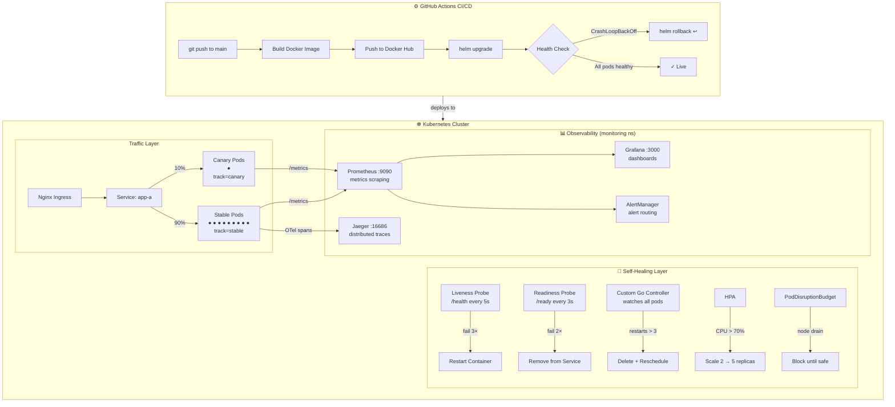

# Self-Healing Kubernetes Platform

[](https://github.com/abhay1999/self-healing-k8s-platform/actions/workflows/ci-cd.yaml)
[](https://go.dev/)
[](https://kubernetes.io/)
[](https://helm.sh/)
[](LICENSE)

> A production-grade platform that automatically detects and recovers from failures in Kubernetes — no human intervention required.

---

## The Problem

Every production system eventually faces the same 3am incident:

| Scenario | Traditional Response | This Platform |
|---|---|---|
| Pod crashes (OOM, bug, bad config) | Alert fires → engineer wakes up → restarts manually | Liveness probe detects failure → container restarts automatically |
| Bad deployment breaks users | Engineer manually runs rollback | Post-deploy health check triggers `helm rollback` |
| Pod stuck in CrashLoopBackOff | Engineer deletes pod | Custom controller detects restart count → deletes and reschedules |
| Traffic spike overwhelms service | Engineer manually scales up | HPA scales to 5 replicas at 70% CPU — no ticket needed |
| Node drained for maintenance | Pod evicted, service drops | PodDisruptionBudget blocks eviction until replacement is ready |
| New version has hidden bug | All users hit the bug | Canary routes 10% traffic first — rollback before full exposure |

**The answer isn't more on-call rotations. It's automating the response.**

---

## Architecture



---

## How It Works

The platform has **7 layers of automated recovery**, each handling a different failure class:

| Layer | Mechanism | Trigger | Recovery Action |
|---|---|---|---|
| 1 | **Liveness Probe** | `/health` fails 3× in 15s | Restart the container |
| 2 | **Readiness Probe** | `/ready` fails 2× in 6s | Stop sending traffic to pod |
| 3 | **Custom Go Controller** | Any container restarts > 3× | Delete pod → K8s reschedules fresh |
| 4 | **Helm Auto-Rollback** | CrashLoopBackOff after deploy | `helm rollback` to last known-good revision |
| 5 | **HPA** | CPU > 70% sustained | Scale from 2 → up to 5 replicas |
| 6 | **PodDisruptionBudget** | Node drain / voluntary eviction | Block until replacement pod is ready |
| 7 | **Canary Rollback** | Bad canary validation | Remove canary → 100% traffic back to stable |

---

## Project Structure

```
self-healing-k8s-platform/
│
├── app/                          # Go microservice
│   ├── main.go                   # HTTP server: /, /health, /ready, /metrics, /crash
│   ├── main_test.go              # Unit tests (handlers, middleware, responseWriter)
│   ├── Dockerfile                # Multi-stage build → minimal alpine image
│   └── go.mod
│
├── controller/                   # Custom Kubernetes controller
│   ├── main.go                   # Watches pods, deletes those with restarts > 3
│   ├── reconciler_test.go        # Unit tests using fake k8s client
│   ├── deploy.yaml               # Deployment + ClusterRole RBAC
│   └── go.mod
│
├── helm-chart/                   # Kubernetes packaging
│   ├── Chart.yaml
│   ├── values.yaml               # All tuneable defaults
│   └── templates/
│       ├── deployment.yaml       # Pods with app + track labels for traffic splitting
│       ├── service.yaml          # Routes to stable AND canary pods (no track selector)
│       ├── hpa.yaml              # CPU-based autoscaler (disabled for canary)
│       └── pdb.yaml              # PodDisruptionBudget (disabled for canary)
│
├── canary/                       # Canary deployment workflows
│   ├── values-canary.yaml        # Helm overrides: 1 replica, no service, track=canary
│   ├── deploy-canary.sh          # Strategy A: replica-ratio traffic split
│   ├── promote-canary.sh         # Upgrade stable image, remove canary release
│   ├── rollback-canary.sh        # Remove canary → 100% stable
│   ├── nginx-deploy-canary.sh    # Strategy B: exact-weight Nginx ingress split
│   ├── nginx-rollback-canary.sh  # Remove Nginx canary ingress + service + release
│   ├── nginx-ingress-stable.yaml # Stable ingress manifest
│   ├── nginx-ingress-canary.yaml # Canary ingress (canary-weight annotation)
│   └── nginx-service-canary.yaml # Service selecting only track=canary pods
│
├── observability/
│   ├── prometheus-values.yaml    # kube-prometheus-stack Helm values
│   ├── jaeger-values.yaml        # Jaeger all-in-one Helm values
│   └── install.sh                # One-command: installs Prometheus + Grafana + Jaeger
│
├── self-healing/
│   ├── auto-rollback.sh          # Post-deploy health check + helm rollback
│   └── alertmanager-rules.yaml   # Alerts: CrashLoop, high error rate, slow p95
│
├── chaos-testing/
│   └── kill-pods.sh              # Randomly kills pods on interval to test resilience
│
└── .github/workflows/
    └── ci-cd.yaml                # Build → Push → Deploy → Health check → Rollback
```

---

## Deployment Guide

### Prerequisites

```bash
# macOS
brew install docker kubectl helm minikube go jq

# Verify
docker info
minikube version
helm version
kubectl version --client
go version
```

### Step 1 — Start the cluster

```bash
minikube start --driver=docker --memory=4096 --cpus=2

kubectl get nodes
# NAME       STATUS   ROLES           AGE   VERSION
# minikube   Ready    control-plane   10s   v1.29.x
```

### Step 2 — Build the app image

```bash
# Point Docker CLI at Minikube's internal registry (no push to Docker Hub needed)
eval $(minikube docker-env)

docker build -t self-healing-app:latest ./app
docker images | grep self-healing-app
```

### Step 3 — Deploy with Helm

```bash
helm install app-a ./helm-chart \
  --set image.repository=self-healing-app \
  --set image.tag=latest \
  --set image.pullPolicy=Never

# Watch pods come up (~20 seconds)
kubectl get pods -w
# NAME                    READY   STATUS    RESTARTS   AGE
# app-a-xxxxxxxxx-xxxxx   1/1     Running   0          15s
# app-a-xxxxxxxxx-xxxxx   1/1     Running   0          15s
```

### Step 4 — Verify the app

```bash
kubectl port-forward svc/app-a 8080:80

curl http://localhost:8080/         # {"service":"app-a","status":"ok"}
curl http://localhost:8080/health   # {"status":"healthy"}
curl http://localhost:8080/ready    # {"status":"ready"}
curl http://localhost:8080/metrics  # Prometheus metrics
```

### Step 5 — Install the observability stack

```bash
./observability/install.sh
# Installs: kube-prometheus-stack (Prometheus + Grafana + AlertManager) + Jaeger
# Takes ~3 minutes

kubectl get pods -n monitoring
# Wait until all pods show STATUS=Running
```

```bash
# Open 3 terminals:
kubectl port-forward svc/prometheus-operated 9090:9090 -n monitoring   # Prometheus
kubectl port-forward svc/prometheus-grafana 3000:80 -n monitoring      # Grafana (admin/admin123)
kubectl port-forward svc/jaeger-query 16686:16686 -n monitoring        # Jaeger
```

### Step 6 — Deploy the custom controller

```bash
eval $(minikube docker-env)
docker build -t self-healing-controller:latest ./controller

kubectl apply -f controller/deploy.yaml
kubectl logs -f deployment/self-healing-controller
```

### Step 7 — Enable CI/CD (optional)

Add these secrets to your GitHub repo (`Settings → Secrets → Actions`):

| Secret | Value |
|---|---|
| `DOCKERHUB_USERNAME` | your Docker Hub username |
| `DOCKERHUB_TOKEN` | Docker Hub access token |
| `KUBECONFIG` | `cat ~/.kube/config \| base64` |

Every push to `main` will then: build image → push → deploy → health check → auto-rollback if unhealthy.

---

## Demo Scenarios

### Scenario 1 — Pod crash and self-healing

```bash
# Terminal 1: watch pods
kubectl get pods -w

# Terminal 2: trigger crash
kubectl port-forward svc/app-a 8080:80
curl http://localhost:8080/crash
```

Watch terminal 1:
```
app-a-xxx   1/1   Running            0    → CrashLoopBackOff 1 → Running 2
```
K8s detects the `/health` probe failure and restarts the container automatically.

---

### Scenario 2 — Bad deploy + auto-rollback

```bash
helm upgrade app-a ./helm-chart \
  --set image.repository=self-healing-app \
  --set image.tag=does-not-exist \
  --set image.pullPolicy=Never

kubectl get pods -w   # pods go into ErrImageNeverPull

./self-healing/auto-rollback.sh app-a 30

helm history app-a
# REVISION  STATUS      DESCRIPTION
# 1         superseded  Install complete
# 2         failed      Upgrade failed
# 3         deployed    Rollback to 1
```

---

### Scenario 3 — Chaos testing (zero-downtime validation)

```bash
# Terminal 1: keep sending requests
watch -n 0.5 'curl -s http://localhost:8080/ | jq .service'

# Terminal 2: kill pods randomly every 10 seconds
./chaos-testing/kill-pods.sh 10 app-a
```

The watch window should never stop responding — K8s reschedules replacement pods before the service notices.

---

### Scenario 4 — Canary deployment

```bash
# Tag a "v2" image
eval $(minikube docker-env)
docker tag self-healing-app:latest self-healing-app:v2

# Deploy to 10% of traffic
./canary/deploy-canary.sh v2

# Verify traffic split
kubectl get pods -l app=app-a -o wide
for i in $(seq 1 20); do curl -s http://localhost:8080/ | jq -r .service; done | sort | uniq -c
#   18 app-a         ← stable
#    2 app-a-canary  ← canary (~10%)

# Promote or roll back
./canary/promote-canary.sh v2      # v2 becomes stable
./canary/rollback-canary.sh        # remove canary, 100% back to v1
```

---

## Running Tests

```bash
# App unit tests (no cluster needed)
cd app && go test ./... -v

# Controller unit tests (uses fake k8s client — no cluster needed)
cd controller && go test ./... -v
```

Tests cover: all HTTP handlers, Prometheus instrumentation middleware, responseWriter status capture, and all reconciler scenarios (skip namespaces, threshold boundary, multi-container pods, pod not found).

---

## Key Technologies

| Technology | Role |
|---|---|
| **Go 1.22** | Microservice + custom Kubernetes controller |
| **Kubernetes 1.29** | Container orchestration, probes, HPA, PDB |
| **Helm 3** | Deployment packaging, rollback management |
| **Prometheus** | Metrics collection (`http_requests_total`, `http_request_duration_seconds`) |
| **Grafana** | Real-time dashboards for cluster and app health |
| **Jaeger + OpenTelemetry** | Distributed tracing for every HTTP request |
| **AlertManager** | Alert routing for CrashLoop, error rate, latency |
| **GitHub Actions** | CI/CD pipeline with automated health checks |
| **Nginx Ingress** | Weight-based canary traffic splitting |
| **controller-runtime** | Custom operator framework |
